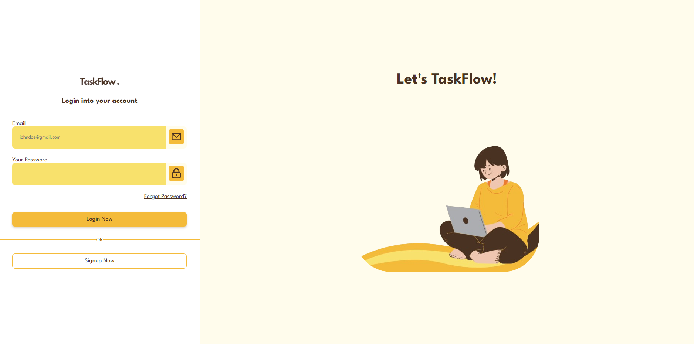

# TaskFlow - Frontend

Este repositório contém o front-end da aplicação **TaskFlow**, uma plataforma para organização e gerenciamento de tarefas. O front-end foi desenvolvido com Angular para oferecer uma interface intuitiva e responsiva.

## Visão Geral

A tela inicial do **TaskFlow** oferece um design moderno e amigável, com campos para login e cadastro. Abaixo está uma prévia:



## Tecnologias Utilizadas

- **Angular**: Framework utilizado para o desenvolvimento do front-end.
- **HTML5 e CSS3**: Estrutura e estilo das páginas.
- **TypeScript**: Linguagem principal usada no Angular.
- **Bootstrap**: Biblioteca para responsividade e componentes de UI.

## Funcionalidades

- **Tela de Login**: Permite aos usuários acessar suas contas.
- **Cadastro de Usuário**: Opção para criar uma nova conta.
- **Design Responsivo**: Experiência otimizada para diferentes dispositivos.

## Como Executar o Projeto

### Pré-requisitos

Certifique-se de ter os seguintes softwares instalados:

- [Node.js](https://nodejs.org/) (versão 16 ou superior)
- [Angular CLI](https://angular.io/cli) (versão 15 ou superior)

### Passo a Passo

1. Clone o repositório:

   ```bash
   git clone https://github.com/seuusuario/taskflow-frontend.git
   ```

2. Navegue até a pasta do projeto:

   ```bash
   cd taskflow-frontend
   ```

3. Instale as dependências:

   ```bash
   npm install
   ```

4. Inicie o servidor de desenvolvimento:

   ```bash
   ng serve
   ```

5. Acesse o front-end em [http://localhost:4200](http://localhost:4200).


## Contribuindo

Contribuições são bem-vindas! Siga os passos abaixo:

1. Faça um fork do repositório.
2. Crie uma branch para sua feature ou correção de bug:

   ```bash
   git checkout -b minha-feature
   ```

3. Faça suas alterações e commit:

   ```bash
   git commit -m 'Adiciona minha feature'
   ```

4. Envie para o repositório remoto:

   ```bash
   git push origin minha-feature
   ```

5. Abra um Pull Request.

## Licença

Este projeto está licenciado sob a Licença MIT. Consulte o arquivo `LICENSE` para mais informações.

---

Caso precise de ajuda com a configuração do projeto ou outros ajustes, é só avisar! 😊
